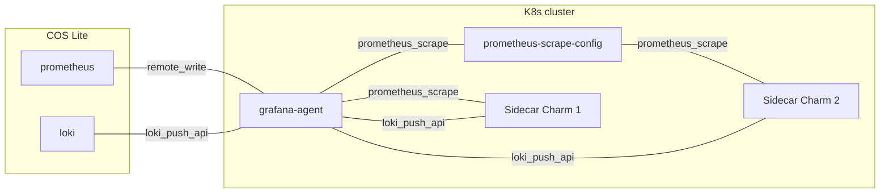

## Integrating Grafana agent

Grafana agent charm integrates with:

- Any charm that supports the `loki_push_api` interface. You can integrate it using the Loki Charm library. The documentation of the charm library, available through [Charmhub](https://charmhub.io/loki-k8s) provides further details. The information exchanged through the `loki_push` interface can be broken down into two parts:

  - Loki charm provides an [endpoint URL](https://grafana.com/docs/loki/latest/api/#post-lokiapiv1push) to receive log from [Loki clients](https://grafana.com/docs/loki/latest/clients/) that relates with this charm.

  - Loki may receive alert rules which tell when to raise alerts. These rules are read from a directory named `loki_alert_rules`, if present at the top level, within the client charm's source (`src`) directory.

- Any charm that supports the `prometheus_scrape` interface.
You can integrate it using the Prometheus Charm library. The documentation of the charm library, available through [Charmhub](https://charmhub.io/prometheus-k8s/libraries) provides further details.

- Any charm that supports the `prometheus_remote_write` interface.
You can integrate it using the Prometheus Charm library. The documentation of the charm library, available through [Charmhub](https://charmhub.io/prometheus-k8s/libraries) provides further details.

Besides this charm also provides the `loki_push_api` interface through the `log_proxy`, so can be used as a Log Proxy between a workload charm and a charm that also implements the `loki_push_api` interface, for instance [Loki](https://charmhub.io/loki-k8s). The documentation of the charm library, available through [Charmhub](https://charmhub.io/loki-k8s) provides further details.

## Deployment scenarios

