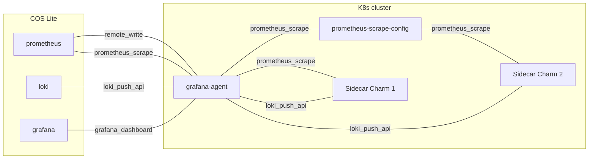

# Integrating Grafana agent

<!-- markdown-toc start - Don't edit this section. Run M-x markdown-toc-refresh-toc -->
**Table of Contents**

- [Integrating Grafana agent](#integrating-grafana-agent)
    - [Provides](#provides)
        - [Logging provider](#logging-provider)
            - [This charm](#this-charm)
            - [Remote charm](#remote-charm)
        - [Grafana dashboard](#grafana-dashboard)
            - [This charm](#this-charm-1)
            - [Remote charm](#remote-charm-1)
        - [Self metrics endpoint](#self-metrics-endpoint)
            - [This charm](#this-charm-2)
            - [Remote charm](#remote-charm-2)
    - [Requires](#requires)
        - [Logging consumer](#logging-consumer)
            - [This charm](#this-charm-3)
            - [Remote charm](#remote-charm-3)
        - [Metrics endpoint](#metrics-endpoint)
            - [This charm](#this-charm-4)
            - [Remote charm](#remote-charm-4)
        - [Send remote write](#send-remote-write)
            - [This charm](#this-charm-5)
            - [Remote charm](#remote-charm-5)
    - [Deployment scenarios](#deployment-scenarios)

<!-- markdown-toc end -->


Grafana Agent Charmed Operator can be integrated with other charms through the following relations.

## Provides

### Logging provider

#### This charm

```yaml
provides:
  logging-provider:
    interface: loki_push_api
```


#### Remote charm

```yaml
requires:
  logging:
    interface: loki_push_api
```

Using this relation, Grafana Agent Charmed Operator can receive logs from any charm that supports the [`loki_push_api`](https://charmhub.io/loki-k8s/libraries/loki_push_api) relation interface (Those logs will later be forwarded to Loki using the `logging-consumer` relation).


The information exchanged through the `loki_push_api` interface can be broken down into two parts:

  - Grafana Agent charm provides an [endpoint URL](https://grafana.com/docs/loki/latest/api/#post-lokiapiv1push) to receive log from charms running [Loki clients](https://grafana.com/docs/loki/latest/clients/).
  - Grafana Agent charm may also receive alert rules which tell when to raise alerts. These rules are read from a directory named `loki_alert_rules`, if present at the top level, within the client charm's source (`src`) directory.


For instance let's say that we need [Zinc Charmed Operator](https://charmhub.io/zinc-k8s) send logs to Grafana Agent.
To do that we can use one of the "consumer" object offered by the `loki_push_api` lib and follow these steps.

1. Specify the relation in the charm's metadata.yaml:

```yaml
requires:
  logging:
    interface: loki_push_api
```

2. Obtain the library from charmhub:

```shell
charmcraft fetch-lib charms.loki_k8s.v0.loki_push_api
```

3. Import the library and use it in your `src/charm.py`:

```python
from charms.loki_k8s.v0.loki_push_api import LogProxyConsumer
...
self._logging = LogProxyConsumer(self, relation_name="logging", log_files=logs_files)
```

4. After deploying Zinc charm relate it with `Grafana Agent`:

```bash
juju relate grafana-agent-k8s:logging-provider zinc-k8s:logging
```


Once the relation is established, Zinc charm can start sending logs to Grafana Agent charm.

### Grafana dashboard

#### This charm

```yaml
provides
  grafana-dashboard:
    interface: grafana_dashboard
```


#### Remote charm

```yaml
requires:
  grafana-dashboard:
    interface: grafana_dashboard
```

Over the `grafana-dashboard` relation using the [`grafana-dashboard`](https://charmhub.io/grafana-k8s/libraries/grafana_dashboard) interface, this Grafana Agent charm also provides meaningful dashboards (placed in `src/grafana_dashboards`) about its metrics to be shown in a [Grafana Charm ](https://charmhub.io/grafana-k8s). These dashboards are placed

In order to add these dashboards to Grafana all that is required is to relate the two charms in the following way:

```bash
juju relate \
    grafana-agent-k8s:grafana-dashboard \
    grafana-k8s:grafana-dashboard
```

### Self metrics endpoint

#### This charm

```yaml
provides:
  self-metrics-endpoint:
    interface: prometheus_scrape
```

#### Remote charm

```yaml
requires:
  metrics-endpoint:
    interface: prometheus_scrape
```

This Grafana Agent charm may forward information about its metrics endpoint and associated alert rules to a Prometheus charm over the `self-metrics-endpoint` relation using the [`prometheus_scrape`](https://charmhub.io/prometheus-k8s/libraries/prometheus_scrape) interface. In order for these metrics to be aggregated by the remote Prometheus charm all that is required is to relate the two charms as in:


```bash
juju relate \
    grafana-agent-k8s:self-metrics-endpoint \
    prometheus-k8s:metrics-endpoint
```

## Requires

### Logging consumer

#### This charm
```yaml
requires:
  logging-consumer:
    interface: loki_push_api
```

#### Remote charm

```yaml
provides:
  logging:
    interface: loki_push_api
```

[Loki](https://charmhub.io/loki-k8s) receives logs forwarded by this Grafana Agent charm, aggregates and deduplicates them.
Grafana Agent Charmed Operator relates to Loki over the `loki_push_api` interface using the `logging-consumer` relation.


```bash
juju relate grafana-agent-k8s:logging-consumer loki-k8s
```


### Metrics endpoint

#### This charm

```yaml
requires:
  metrics-endpoint:
    interface: prometheus_scrape
```

#### Remote charm

```yaml
provides:
  metrics-endpoint:
    interface: prometheus_scrape
```

Charms may forward information about their metrics endpoints and associated alert rules to the Grafana Agent charm over the `metrics-endpoint` relation using the [`prometheus_scrape`](https://charmhub.io/prometheus-k8s/libraries/prometheus_scrape) interface.

```shell
juju relate grafana-agent-k8s:metrics-endpoint zinc-k8s
```

Charms that seek to provide metrics endpoints and alert rules must do so using the provided [`prometheus_scrape`](https://charmhub.io/prometheus-k8s/libraries/prometheus_scrape) charm library.  This library by implementing the `metrics-endpoint` relation, not only ensures that scrape jobs and alert rules are forward to Grafana Agent but also that these are updated any time the metrics provider charm is upgraded. For example new alert rules may be added or old ones removed by updating and releasing a new version of the metrics provider charm. While it is safe to update alert rules as desired, care must be taken when updating scrape job specifications as this has the potential to break the continuity of the scraped metrics time series. In particular changing the following keys in the scrape job can break time series continuity
- `job_name`
- `relabel_configs`
- `metrics_relabel_configs`
- Any label set by `static_configs`

Evaluation of alert rules forwarded through the [`prometheus_scrape`](https://charmhub.io/prometheus-k8s/libraries/prometheus_scrape) interface are automatically limited to the charmed application that provided these rules. This ensures that alert rule evaluation is scoped down to the charm providing the rules.

### Send remote write

#### This charm

```yaml
requires:
  send-remote-write:
    interface: prometheus_remote_write
```

#### Remote charm

```yaml
provides:
  receive-remote-write:
    interface: prometheus_remote_write
```


Grafana Agent may forward client charms metrics and associated alert rules (that are received using the `metrics-endpoint` relation) to Prometheus using the [`prometheus_remote_write`](https://charmhub.io/prometheus-k8s/libraries/prometheus_remote_write) interface.
To do that you have to relate Grafana Agent with Prometheus:

```bash
juju relate grafana-agent-k8s:send-remote-write prometheus-k8s
```


Once these relations are established, you can check that by running:

```bash
juju status --relations

Model  Controller  Cloud/Region        Version  SLA          Timestamp
docs   charm-dev   microk8s/localhost  2.9.32   unsupported  17:55:18-03:00

App                Version  Status   Scale  Charm              Channel    Rev  Address         Exposed  Message
grafana                     active       1  grafana-k8s        edge        40  10.152.183.168  no
grafana-agent-k8s           active       1  grafana-agent-k8s  edge        11  10.152.183.123  no
loki-k8s                    waiting      1  loki-k8s           edge        41  10.152.183.43   no
prometheus-k8s     2.33.5   active       1  prometheus-k8s     candidate   55  10.152.183.128  no
zinc-k8s           0.2.8    active       1  zinc-k8s           stable      26  10.152.183.247  no

Unit                  Workload  Agent       Address       Ports  Message
grafana-agent-k8s/0*  active    idle        10.1.157.120
grafana/0*            active    idle        10.1.157.88
loki-k8s/0            active    idle        10.1.157.86
prometheus-k8s/0*     active    idle        10.1.157.89
zinc-k8s/0*           active    idle        10.1.157.79

Relation provider                        Requirer                             Interface                Type     Message
grafana-agent-k8s:grafana-dashboard      grafana:grafana-dashboard            grafana_dashboard        regular
grafana-agent-k8s:logging-provider       zinc-k8s:logging                     loki_push_api            regular
grafana-agent-k8s:self-metrics-endpoint  prometheus-k8s:metrics-endpoint      prometheus_scrape        regular
grafana:grafana                          grafana:grafana                      grafana_peers            peer
loki-k8s:logging                         grafana-agent-k8s:logging-consumer   loki_push_api            regular
prometheus-k8s:prometheus-peers          prometheus-k8s:prometheus-peers      prometheus_peers         peer
prometheus-k8s:receive-remote-write      grafana-agent-k8s:send-remote-write  prometheus_remote_write  regular
zinc-k8s:metrics-endpoint                grafana-agent-k8s:metrics-endpoint   prometheus_scrape        regular
```


## Deployment scenarios


